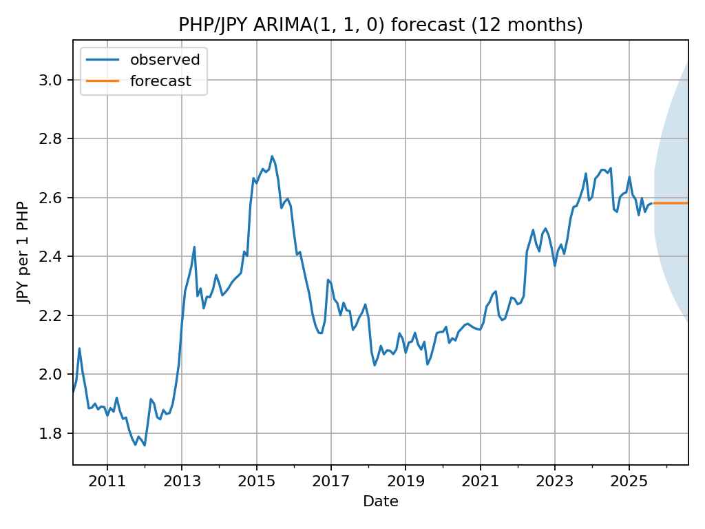
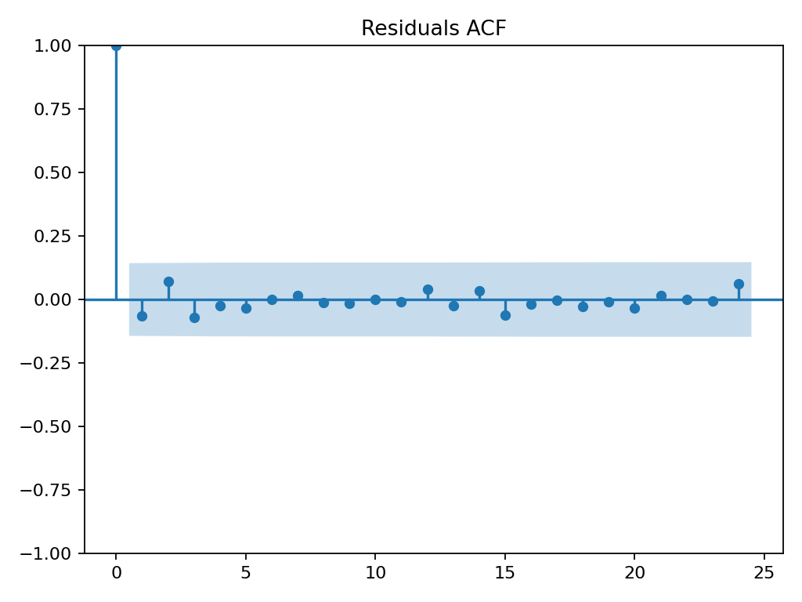
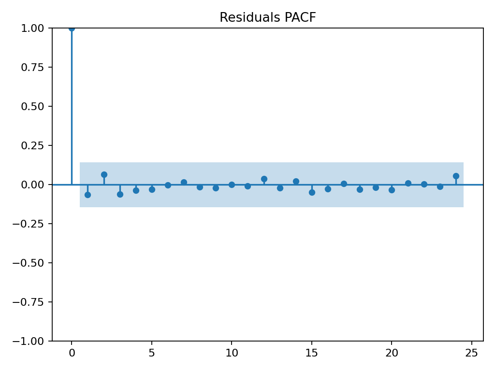
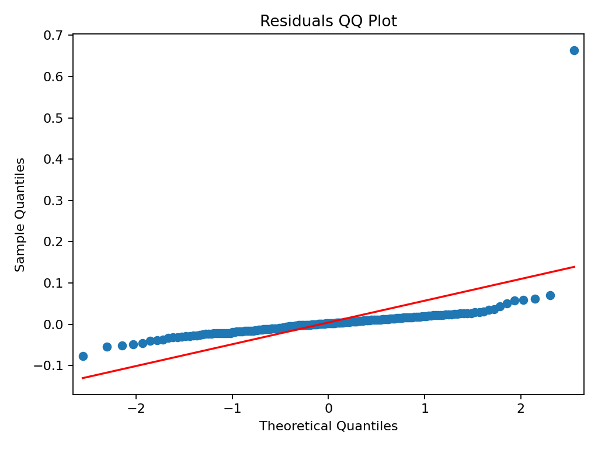

# PHP/JPY ARIMA Forecast (Monthly)

## 📑 Table of Contents
1. Overview
2. How to Run
3. Project Structure
4. Forecast Preview
5. Notes

## Overview
This project downloads PHP/JPY exchange rate data from Yahoo Finance, aggregates it to monthly averages, fits an ARIMA model (via statsmodels), and exports a 12‑month forecast.

## How to Run
    python -m venv .venv
    source .venv/bin/activate
    pip install -r requirements.txt
    python fetch_data.py
    python analyze_fx_step1.py      # quick plot
    python analyze_fx_step2.py      # model + forecast chart
    python analyze_fx_export.py     # saves outputs

## Project Structure
    data/                 # downloaded CSVs
    output/               # forecast_12m.csv, residuals.csv, model_summary.txt
    assets/forecast_12m.png
    fetch_data.py
    analyze_fx_step1.py
    analyze_fx_step2.py
    analyze_fx_export.py
    README.md
    requirements.txt
    LICENSE

## Forecast Preview

## Notes
- The pipeline picked ARIMA(1,1,0) by AIC on log‑levels.
- Forecasts are shown in levels (JPY per PHP). Bands are model prediction intervals.

## Diagnostics
This repo also runs a **seasonal ARIMA (SARIMA)** with residual checks.

**Run diagnostics**
    python diagnostics.py

**Artifacts (in `output/`):**
- `sarima_forecast_12m.csv`, `sarima_forecast_12m.png`
- `sarima_residuals.csv`
- `diag_resid_acf.png`, `diag_resid_pacf.png`, `diag_resid_qq.png`
- `diag_ljungbox.csv` (Ljung–Box p‑values at lags 12 and 24)

**Interpretation tips**
- ACF/PACF of residuals should show no strong spikes → indicates whiteness.
- Ljung–Box p‑values > 0.05 suggest residuals are uncorrelated (good).
- QQ plot close to the line indicates approximately normal residuals.

## Diagnostics Preview

Residual checks from the SARIMA run:

**Plots**
- Autocorrelation (ACF):  
  
- Partial Autocorrelation (PACF):  
  
- Normality (QQ):  
  

**Tables**
- [Ljung–Box p‑values (lags 12 & 24)](output/diag_ljungbox.csv)
- [SARIMA 12‑month forecast table](output/sarima_forecast_12m.csv)
- [Residuals series](output/sarima_residuals.csv)
